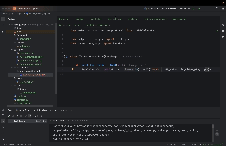

## Test Demo

## Project structure
framework/browser.py - browser and driver setup and settings
helpers/ui_helper.py - wrapper of selenium, and also methods to work with UI

pages/base_page.py
pages/twitch_browse_page.py
pages/twitch_home_page.py
pages/twitch_stream_page.py 
Page object style division of responsibilities of methods which work with different pages

screenshots/ - folder where test screenshots are saved
tests/ - folder which contains test scripts
utils/drivers/ - folder for browser drivers
also in utils things like logger can be added

## Setup and Installation

1. Clone the repository
2. Install dependencies: pip install -r requirements.txt
3. Make sure you have Chrome browser installed

## Running Tests
pytest tests/test_twitch.py